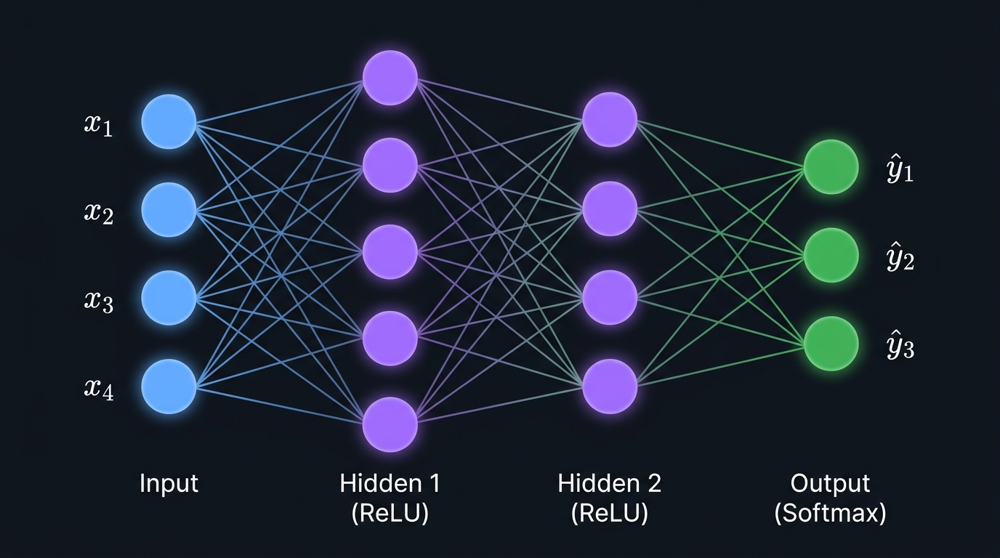
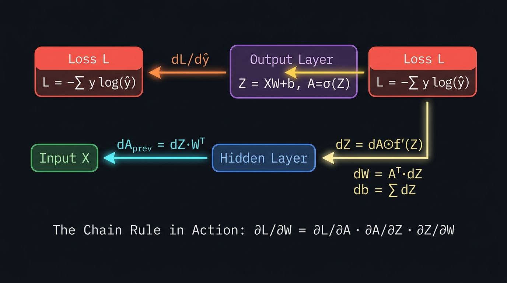

<div align="center">

# 🧠 Neural Network from Scratch

**A complete, mathematically documented neural network library built with Python + NumPy only.**

*No PyTorch. No TensorFlow. No Keras. Every gradient, every weight update, written by hand.*

[](https://python.org)
[](https://numpy.org)
[](LICENSE)
[](#results)
[](#verification)

</div>

---

## What Is This?

This project implements a fully working neural network **library** from the ground up — not just a single script, but a modular framework with the same structure as PyTorch or Keras, except every internal calculation is written in plain NumPy and thoroughly documented with its mathematical derivation.

The goal is **deep understanding**, not just working code. Every file answers the question: *why does this formula look like this?*

---

## Architecture Diagram



A **Dense layer** stacks `n_out` neurons side-by-side. For a batch of `m` samples:

```
Z = X @ W + b        →    A = f(Z)
(m, n_in) @ (n_in, n_out) + (1, n_out)  =  (m, n_out)
```

Every input connects to every output neuron — hence "fully connected" or "dense."

---

## Backpropagation — The Chain Rule in Action



After the forward pass computes the loss `L`, gradients flow **backwards** through every layer using the chain rule:

```
dZ   = dA ⊙ f'(Z)          ← gradient through activation
dW   = Aᵀ · dZ             ← gradient for weights   (Aᵀ is prev layer output)
db   = Σ dZ                 ← gradient for biases
dA_prev = dZ · Wᵀ          ← gradient to pass to layer below
```

> **Key insight:** `loss.gradient()` already returns the mean gradient (÷m), so the layer backward receives dZ pre-scaled — **no second division by m**.

---

## Project Structure

```
NN_Scratch/
│
├── 📦 neuralnet/                   ← Core library (NumPy only)
│   ├── tensor.py                   ← dtype utilities (float64 everywhere)
│   ├── initializers.py             ← Zero · Random · Xavier · He
│   ├── activations.py              ← ReLU · LeakyReLU · Sigmoid · Tanh · Softmax
│   ├── losses.py                   ← MSE · BCE · CCE · SoftmaxCCE (fused)
│   ├── layers.py                   ← DenseLayer · DropoutLayer  ← THE HEART
│   ├── optimizers.py               ← SGD → Momentum → RMSProp → Adam
│   ├── network.py                  ← Sequential model (training loop)
│   └── utils/
│       ├── data_utils.py           ← split · batch · one-hot · normalise
│       ├── metrics.py              ← accuracy · precision · recall · F1
│       └── visualizer.py          ← loss curves · decision boundary · weight histograms
│
├── 📂 examples/
│   ├── 01_xor_problem.py           ← Proves backprop works (non-linearity proof)
│   ├── 02_binary_classification.py ← Overfitting demo + optimizer comparison
│   ├── 03_mnist_digits.py          ← Real digit recognition, 97% accuracy
│   └── gradient_check.py          ← Numerical gradient verification
│
├── 📖 THEORY.md                    ← 14-section mathematical guide
├── requirements.txt
└── README.md
```

---

## Training Pipeline

```mermaid
flowchart TD
    A([Raw Data]) --> B[Preprocess\nStandardise · One-Hot · Split]
    B --> C[Build Model\nSequential + DenseLayer + Dropout]
    C --> D[Compile\nLoss + Optimizer]
    D --> E{Training Loop}

    E --> F[Shuffle Data]
    F --> G[Mini-Batch]
    G --> H[Forward Pass\nZ=XW+b, A=f Z]
    H --> I[Compute Loss\nL = loss y, ŷ]
    I --> J[Backward Pass\ndW, db via chain rule]
    J --> K[Optimizer Step\nW ← W - η·update]
    K --> L{More batches?}
    L -- Yes --> G
    L -- No --> M[Epoch Metrics\ntrain_loss, val_loss, acc]
    M --> N{More epochs?}
    N -- Yes --> F
    N -- No --> O([Trained Model])

    style A fill:#238636,color:#fff
    style O fill:#238636,color:#fff
    style I fill:#da3633,color:#fff
    style J fill:#8957e5,color:#fff
    style K fill:#1f6feb,color:#fff
```

---

## Optimizers — A Progressive Story

```mermaid
graph LR
    A[SGD\nW ← W - η·dW] -->|add momentum| B[SGD + Momentum\nv ← βv + dW\nW ← W - η·v]
    B -->|adaptive lr| C[RMSProp\ns ← βs + dW²\nW ← W - η·dW/√s]
    C -->|both together + bias fix| D[Adam ⭐\nm̂/√v̂ with bias correction]

    style A fill:#21262d,color:#8b949e,stroke:#30363d
    style B fill:#21262d,color:#e3b341,stroke:#d29922
    style C fill:#21262d,color:#58a6ff,stroke:#1f6feb
    style D fill:#238636,color:#fff,stroke:#2ea043
```

Each optimizer is implemented from scratch with its full derivation in [`optimizers.py`](neuralnet/optimizers.py).

---

## Activation Functions

```mermaid
graph LR
    subgraph "Hidden Layers"
        R[ReLU\nmax 0,z\nf'= 1 if z>0\nelse 0]
        LR[LeakyReLU\nαz if z≤0\nFixes dying ReLU]
        T[Tanh\ne^z - e^-z / e^z + e^-z\nZero-centred]
    end
    subgraph "Output Layer"
        S[Sigmoid\n1 / 1+e^-z\nBinary classification]
        SM[Softmax\ne^zk / Σe^zj\nMulti-class]
    end

    style R fill:#1f6feb,color:#fff,stroke:none
    style LR fill:#388bfd,color:#fff,stroke:none
    style T fill:#8957e5,color:#fff,stroke:none
    style S fill:#da3633,color:#fff,stroke:none
    style SM fill:#238636,color:#fff,stroke:none
```

---

## Results

### ✅ Gradient Check — All 18 Parameters Verified
